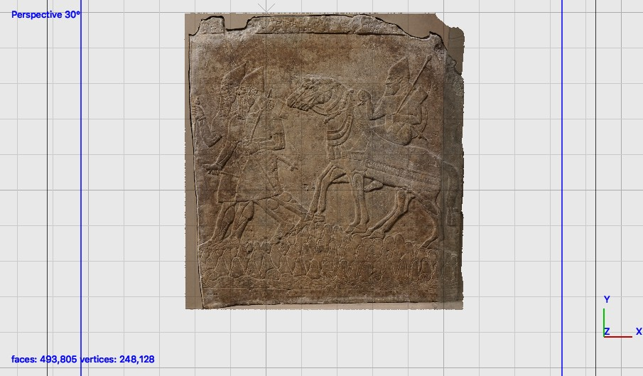

[](http://creativecommons.org/licenses/by-sa/4.0/) 
[](http://orcid.org/0000-0002-0246-2335)

# Gypsum relief Room WG North West Corner, Nimrud



This repository contains source data to recreate a 3D model from the British Museum's Assyrian collection. The file structure is as follows:

```
ladders/
├── README.md
├── LICENSE.md
├── images
├── masks
├── other
|── cameras
└── models
   |-OBJ
   |-STL
   |-PLY
```
Models are included as PLY, OBJ and STL representations. 

# Metadata 

Part of a corner slab (?) of gypsum wall panel relief: showing two soldiers and a man with two horses crossing mountains. There is an inscription written in cuneiform script at the right side of the corner panel.

Ashurnasirpal II’s Nimrud NW Palace room WG dating to c. 874 BC
Materialsgypsum

Height: 100 centimetres Width: 93 centimetres

54 photographs, Sony A6000, processed in Photoscan pro. 

https://www.britishmuseum.org/research/collection_online/collection_object_details.aspx?objectId=805213&partId=1&searchText=124558&page=1

# LICENSE
The contents of this repository are licensed under CC-BY

# Credits

Photographs and models by Daniel Pett - 26 Huawei mobile phone. 
